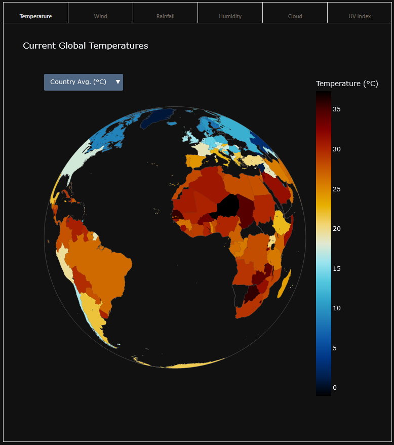
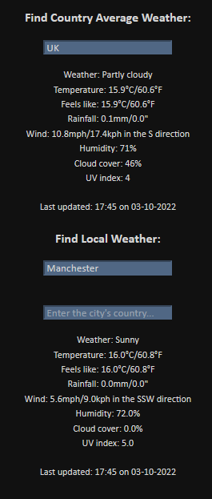
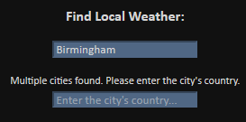
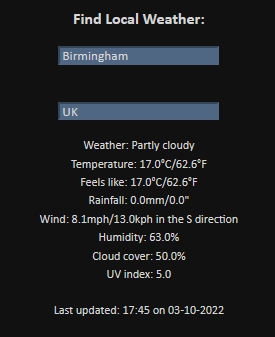
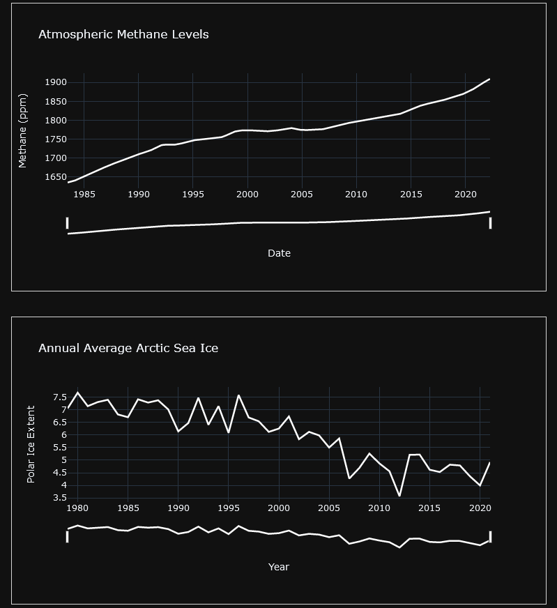
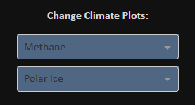

# Climate Dashboard

## Requirements
- Python 3.10 or higher
- [Global Airports SQLite database](http://www.partow.net/downloads/GlobalAirportDatabase_SQLiteDB.zip)
- A weather API key from [https://www.weatherapi.com/](https://www.weatherapi.com/)

## Running the dashboard
1. Download the climate-dashboard package and activate a new virtual environment.
2. Install the required dependencies with:
    ``` 
    pip install -r requirements.txt 
    ```
3. Start the app with:
    ```
    python app.py
    ```
4. Paste your weather API key into the console to access the dashboard.
5. Once the dashboard has loaded, the console will output the link to the Flask app. Click on this to open the dashboard.

## Using the dashboard
### Live Weather
There are six different weather feature tabs to choose from. Interact with the dropdowns on each figure to customise units or whether you want to see city or country averaged data.



Additionally, text data is available with current weather readings and local conditions, again either for a specific city or a country's average.



As some city names are duplicated across different countries, a prompt will appear if this is the case. Simply enter the city's country in the box below.





### Climate Change Graphs
Graphs containing climate change data over time can be shown in the two middle plotspaces. These are also able to be customised by adjusting the sliders below the x-axis to fit the graph to a specific timeframe.



Use the dropdowns in the top right corner of the dashboard to customise these.



## Acknowledgements

This dashboard would not exist without the following locational, weather and climate change data:
- [The Global Airport Database](http://www.partow.net/miscellaneous/airportdatabase/index.html#VersionHistory)
- [Weather API](https://www.weatherapi.com/)
- [Global Warming and Climate Change API](https://global-warming.org/)